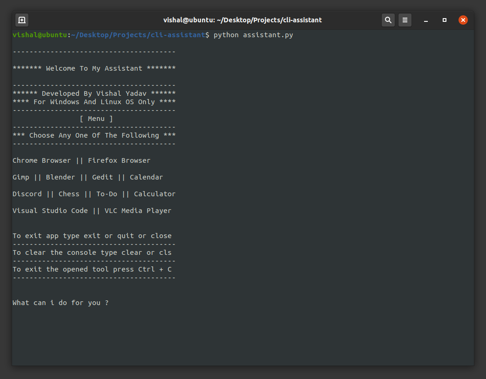

# cli-assistant
A Python CLI Assistant For Opening Windows And Linux Applications.

[](https://github.com/Vishal1297/cli-assistant/stargazers)
[](https://github.com/Vishal1297/cli-assistant/network/members)
[](https://github.com/Vishal1297/cli-assistant/pulls)
[](https://github.com/Vishal1297/cli-assistant/issues)
[](https://github.com/Vishal1297/cli-assistant/blob/master/LICENSE)

**Python 3.x Modules Used :**

- **[sys](https://docs.python.org/3/library/sys.html)**
- **[pyttsx3](https://pyttsx3.readthedocs.io/en/latest/engine.html)**
- **[platform](https://docs.python.org/3/library/platform.html)**
- **[subprocess](https://docs.python.org/3/library/subprocess.html)**

**Requirements :**

- **python3.x**
- **pip3**

**Supported Applications :**

**Windows :**

```
  Chrome Browser, Firefox Browser, Notepad, Visual Studio Code, Discord, Gimp,
  VLC Media Player, Windows Media Player, Calculator, Calender, Blender.
```

**Linux :**

```
  Chrome Browser, Firefox Browser, Gedit, Visual Studio Code, VLC Media Player,
  Calculator, Calendar, Discord, Chess, To Do, Gimp, Blender.
```

**To Run :**

```
  # python assistant.py 
          or 
  # python3 assistant.py
```

### *Screenshots :*

 
